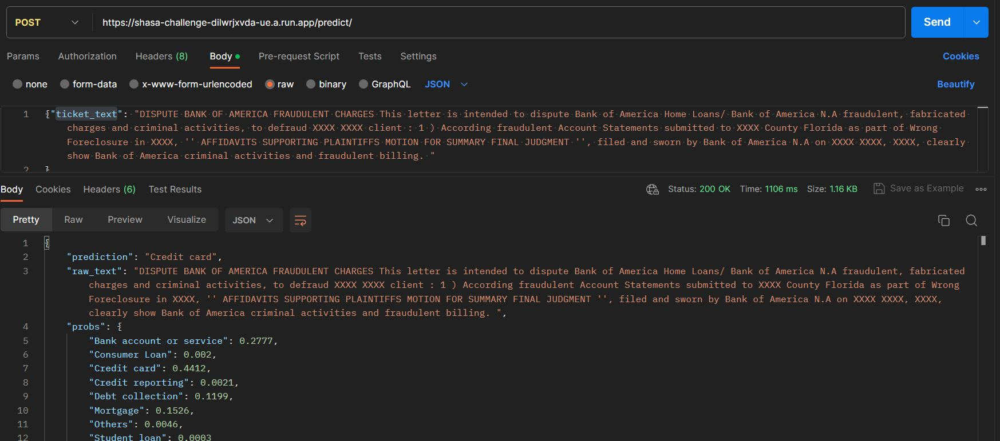
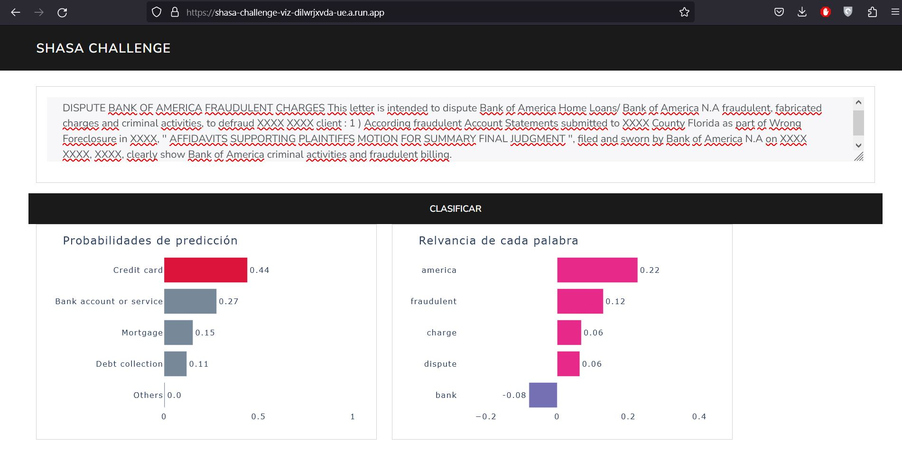

# Clasificacion de texto

El objetivo es realizar un modelo de clasificación multi clase, mediante un algoritmo de ML.

Dentro de la solución se presenta un API para hacer predicciones con el modelo y una app interactiva.

# Instalar requerimientos

## Crear la carpeta /data y colocar los archivos **"customer-issues-train.csv"** y **"customer-issues-test.csv"**
github no me permitio subir los datasets completos :(


```
pip install -r requirements.txt
python -m spacy download en_core_web_sm

```

# Descripción

El proyecto contiene tres archivos principales `EDA_TRAIN.ipynb`, el cual es notebook con el análisis exploratiorio y código para el entrenamieto del modelo, `main.py` que contiene el código de la API y `app.py` con el código de la app.

Adicional estan los archivos `train_model.py` y `clean_text.py`, con funciones axiliares durante el proceso

# Probar API

Se puede accceder a la API a través de:

```
https://mi_url/predict/

```
Sólo hay realizar la petición **POST** con un body en formato json

```
{"ticket_text": "TEXTO LIBRE"}

```

## Ejemplo

Se puede realizar una solicitud desde python, o usando postman.


Ejemplo python:
```
import requests


url = "URL"

my_request = {"ticket_text": "DISPUTE BANK OF AMERICA FRAUDULENT CHARGES This letter is intended to dispute Bank of America Home Loans/ Bank of America N.A fraudulent, fabricated charges and criminal activities, to defraud XXXX XXXX client : 1 ) According fraudulent Account Statements submitted to XXXX County Florida as part of Wrong Foreclosure in XXXX, '' AFFIDAVITS SUPPORTING PLAINTIFFS MOTION FOR SUMMARY FINAL JUDGMENT '', filed and sworn by Bank of America N.A on XXXX XXXX, XXXX, clearly show Bank of America criminal activities and fraudulent billing. """}

x = requests.post(url, json = my_request)

print(x.text)


```

Respuesta:

```
{
"prediction": "Credit card",

"raw_text": "DISPUTE BANK OF AMERICA FRAUDULENT CHARGES This letter is intended to dispute Bank of America Home Loans/ Bank of America N.A fraudulent, fabricated charges and criminal activities, to defraud XXXX XXXX client : 1 ) According fraudulent Account Statements submitted to XXXX County Florida as part of Wrong Foreclosure in XXXX, '' AFFIDAVITS SUPPORTING PLAINTIFFS MOTION FOR SUMMARY FINAL JUDGMENT '', filed and sworn by Bank of America N.A on XXXX XXXX, XXXX, clearly show Bank of America criminal activities and fraudulent billing. ",

"probs": {
        "Bank account or service": 0.2777,
        "Consumer Loan": 0.002,
        "Credit card": 0.4412,
        "Credit reporting": 0.0021,
        "Debt collection": 0.1199,
        "Mortgage": 0.1526,
        "Others": 0.0046,
        "Student loan": 0.0003
    },
"key_words": {
        "america": 0.2287620362321192,
        "fraudulent": 0.1266362255141424,
        "foreclosure": -0.0702341382364639,
        "charge": 0.06672441135067893,
        "dispute": 0.060451501070733216
    }
}
```

Captura de pantalla




Devuelve un objeto json con los elementos
* prediction: Clasificación de producto estimada
* raw_text: Texto ingresado
* probs: probabilidades de clasificación para todas las categorias
* key_words: Palabras más relevantes dentro del texto, obtenidas por LIME


# App interactiva

Se tiene que ingresar un texto dentro de la caja de texto, presionar "Clasificar" y la app muestra un gráfico con el top 5 de productos más probables a la que pertenecen el texto, indicado en rojo la clasificación más probable.

Adicional muestra palabras más relevantes dentro del texto, obtenidas por LIME





# Ejecutar API de forma local
Estar dentro de la ruta del proyecto y ejecutar:

```
uvicorn main:app
```

Una vez iniciado el servidor, se pude acceder desde y realizar la solicitud **POST**

```
http://127.0.0.1:8000/predict/

```


# Ejecutar App de forma local
Estar dentro de la ruta del proyecto y ejecutar:

```
python app.py
```

Una vez iniciado el servidor, se pude acceder desde 

```
http://0.0.0.0:8000/

```
